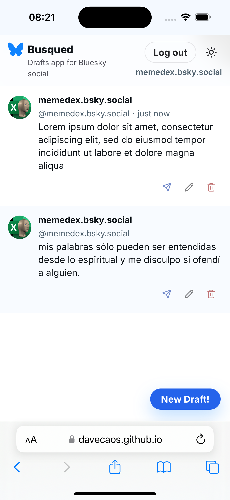
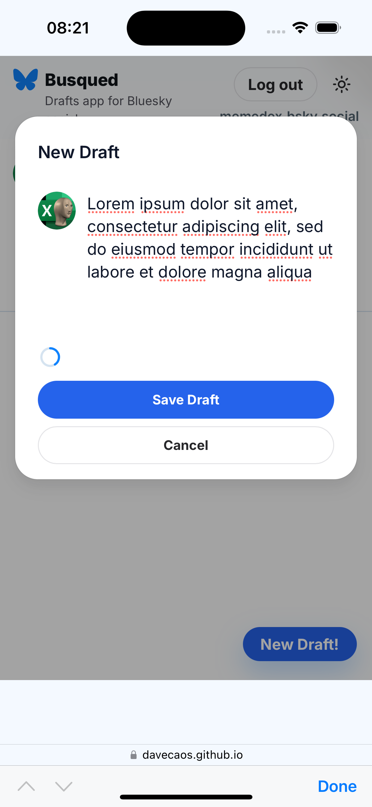

# Busqued

**Drafts for Bluesky.social 🦋**

Busqued is a tiny, fast web app for writing and saving **Bluesky post drafts** before you publish them. It looks and feels like the Bluesky app — centered feed, post cards, a compose box with a live character ring — and lets you post a draft straight to your account over the AT Protocol when you're ready.

🔗 **Live:** https://davecaos.github.io/busqued/

<p align="center">
  
  
</p>

## Features

- 📝 **Draft management** — create, edit, and delete drafts; everything is saved locally in `localStorage` (no backend, no account needed to start).
- 🦋 **Bluesky-style UI** — circular avatar, display name · `@handle` · timestamp, and edge-to-edge post cards in a centered feed.
- ✍️ **Composer with a live character ring** — a Bluesky-style circle that counts down the remaining characters (300 → 0) as you type.
- 🚀 **Post to Bluesky** — sign in with your handle + an [app password](https://bsky.app/settings/app-passwords) and publish a draft over the AT Protocol (`@atproto/api`). Your session is persisted and restored on reload.
- 👤 **Real profile** — once logged in, your actual avatar and display name appear on the cards and in the composer.
- 🌗 **Light / dark mode** — a sun/moon toggle with a Bluesky-accurate dark theme.
- 📱 **Responsive** — full-width edge-to-edge on phones and tablets, centered column on desktop.

## Tech stack

- [React 18](https://react.dev/) + [TypeScript](https://www.typescriptlang.org/)
- [Vite 6](https://vite.dev/) (build & dev server)
- [Chakra UI v3](https://www.chakra-ui.com/) + [next-themes](https://github.com/pacocoursey/next-themes) for theming
- [@atproto/api](https://github.com/bluesky-social/atproto) for Bluesky auth & posting (lazy-loaded)
- [react-icons](https://react-icons.github.io/react-icons/) (Lucide set)

## Getting started

```bash
npm i
npm run dev            # start the dev server
npm run dev -- --host  # also expose it on your local network
```

Then open the printed URL (e.g. http://localhost:5173/busqued/).

## Scripts

| Command | What it does |
| --- | --- |
| `npm run dev` | Start the Vite dev server with HMR |
| `npm run build` | Type-check (`tsc -b`) and build to `dist/` |
| `npm run preview` | Serve the production build locally |
| `npm run lint` | Run ESLint |
| `npm run format` | Format `src/` with Prettier |
| `npm run deploy` | Build and publish `dist/` to GitHub Pages |

## How it works

- All drafts live in `localStorage` under `busqued.v0.1`; the Bluesky session is stored under `busqued.bsky.session.v1`.
- Login uses Bluesky **app passwords** via `BskyAgent` — your main account password is never used.
- The app is a single-page client deployed to GitHub Pages under the `/busqued/` base path; there is no server.

## License

Personal project — use at your own risk.
